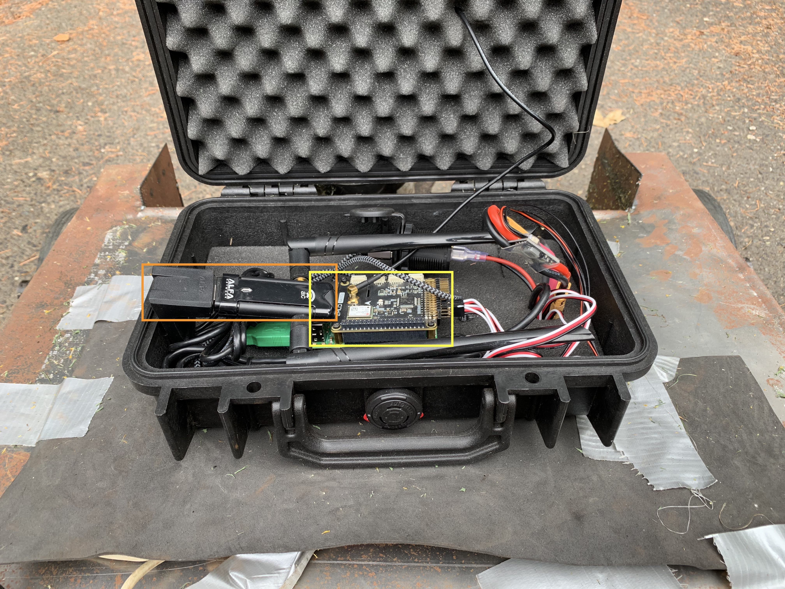
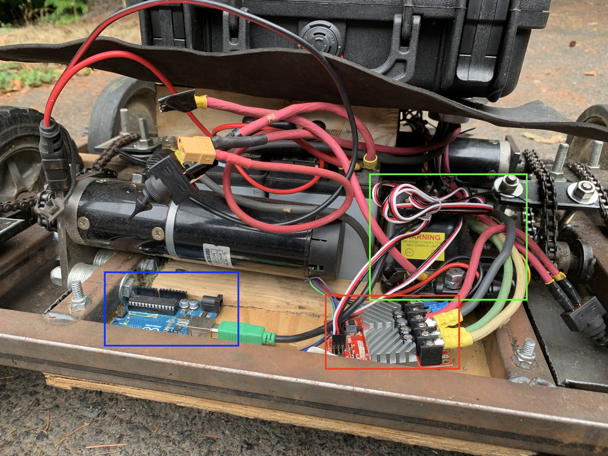

# moby

The full control system (in its current state of development) for Moby, an experimental autonomous robot brushmower. With the code in this repository, Moby can autonomously drive while remaining within a specified geographic boundary (rectangular and aligned along the cardinal directions). The boundary is defined by the GPS coordinates of the southwest and northeast corners. 

# Hardware Architecture

Moby consists of a welded steel chassis and removable sheet steel "shell." It has three motors: one for each side of its differential drive system and one for the blade. 


The "brain" of the robot is contained in a modified Pelican case mounted above the batteries, and consists of a Raspberry Pi 3 Model B+ with an Emlid Navio2 sensor shield (highlighted in yellow) as well as a AC wireless adapter (highlighted in orange) connected via USB for longer range. The Navio2 provides GPS (with the antenna visible on the top of the robot in the exterior photo), a 9-axis IMU, a barometer, and PWM outputs to the motor controllers.



The robot's motors are run by two controllers: a RoboClaw dual-channel motor controller (red) controls the drive motors, while a VexPro Jaguar controller (green) controls the blade. Both are connected to the PWM ports on the Raspberry Pi. Additionally, an Arduino Uno (blue) is present for future sensor connections.



# Software Architecture

Most of Moby's control logic runs on the Raspberry Pi/Navio (using the Emlid-provided driver image). The remainder (specifically the guidance and visualization logic) is being run on an offboard Linux system, but can also be run on the Pi. The control system uses ROS, with several different nodes providing aspects of Moby's functionality.

## ROS Topography

Moby can run in two configurations (for which two `roslaunch` files are provided), AI and manual. 

In AI mode, the ROS nodes are organized in this manner. The GPS and IMU data provide input into the guidance algorithm, which then sends motor outputs to the output node. In the setup configured in the provided AI roslaunch file, the guidance and visualizer nodes run on the base station and the remainder run on the Pi.


In manual mode, the nodes look like this. The robot can be controlled by any Unix computer running the UDP client script provided in the `utils` folder, and the `server` node reads the UDP packets and sends this data to the output node. The bottom path is the only one relevant to robot movement, with the remainder being for the visualization. As in the AI example, the visualizer runs on the base station and the remainder of the nodes run on the Pi.


Additionally, the Arduino sketch in the `utils` folder can be used to communicate with the Raspberry Pi running the `arduino.py` node over USB/serial. This will publish the state of the Arduino's digital and analog sensors to the ROS network.

## ROS Parameters

Moby's guidance system is governed by a number of parameters.

### Global Parameters

These parameters are resolved relative to the namespace the node is in, but are used by multiple nodes. Therefore, if all the nodes are in the `moby` namespace (as shown above), the `foo` global parameter would be at `moby/foo`.

#### Geofence Configuration (`geofence/`)

This is used for defining the geofence that the guidance system will stay within. The parameters are fairly self-explanatory. All latitudes and longitudes should be in degrees. The geofence configuration is the only **required** set of parameters; all others have defaults.

```yaml
geofence:
  lat:
    min: 45.5139707
    max: 45.5139901
  lon:
    min: -122.6800915
    max: -122.6899015
```

#### Secondary Geofence Configuration (`secondary_geofence/`)

Moby actually has two geofences---one that the system will remain within, but may make momentary excursions from (the main geofence), and a secondary one outside of which the robot will shut down. The secondary geofence can be configured either by setting the `secondary_geofence/width` parameter, which will create the secondary geofence offset outside the primary geofence by the given amount, or by manually setting the boundaries.

```yaml
secondary_geofence:
  lat:
    min: 45.5139707
    max: 45.5139901
  lon:
    min: -122.6800915
    max: -122.6899015
```

If neither is set, the system will automatically default to behaving as if  `secondary_geofence/width` was set to 0.00002 degrees, which corrresponds to roughly ten feet of either latitude or longitude. If only a subset of the manual parameters are set, the remainder default to setting based on the provided `secondary_geofence/width` (or its default of 0.00002). For example, if an obstruction meant that the robot required a smaller secondary geofence to the south, but a normal secondary geofence on other boundaries, then the `secondary_geofence/lat/min` parameter could be set and allow the remaining parameters to remain default.

### Node Parameters

These parameters are specific to a node and are prefixed by the nodes' name. The `~` denotes the node's name; as such, if an Arduino node were at `/moby/arduino`, its `~address` parameter would be `/moby/arduino/address`.

#### `arduino.py` Parameters

| Name       | Description                                     | Default        |
| ---------- | ----------------------------------------------- | -------------- |
| `~address` | The hardware address for the Arduino connection | `/dev/ttyACM0` |
| `~baud`    | The serial baudrate.                            | 115200         |

#### `server.py` Parameters

| Name            | Description                                                  | Default |
| --------------- | ------------------------------------------------------------ | ------- |
| `~port`         | The port on which to listen for UDP packets.                 | 5001    |
| `~recv_timeout` | The time to wait, in seconds, for a new UDP packet before considering the robot to have lost connection and stopping. | 0.1     |

#### `guidance.py` Parameters

| Name                | Description                                                  | Default |
| ------------------- | ------------------------------------------------------------ | ------- |
| `~after_turn_drive` | The time to drive forward, in seconds after exiting the geofence and turning back. Higher values may cause issues with small geofences. | 3       |

#### `barometer.py` Parameters

| Name               | Description                                                  | Default |
| ------------------ | ------------------------------------------------------------ | ------- |
| `~moving_avg_size` | The number of samples to take for the barometer's moving average of pressure. A sample is taken 10 times per second. | 50      |

#### `visualizer.py` Parameters

|                        Name | Description                                                  |                   Default |
| --------------------------: | ------------------------------------------------------------ | ------------------------: |
|              `~gps_divisor` | Essentially, the scaling from GPS coordinates to visualizer coordinates. Smaller values scale up the X and Y axes of the display. |                   0.00001 |
|             `~baro_divisor` | Essentially, the scaling from barometric pressure to visualizer coordinates. Smaller values scale up the Z axis of the display. |                        10 |
|              `~trace_color` | The color of the GPS trace of the robot's movement. Actually takes 4 subparameters (`r`, `g`, `b`, and `a`, from 0 to 1) to specify the color. |                     Green |
|   `~primary_geofence_color` | The color of the primary geofence display. Actually takes 4 subparameters (`r`, `g`, `b`, and `a`, from 0 to 1) to specify the color. |                    Yellow |
| `~secondary_geofence_color` | The color of the secondary geofence display. Actually takes 4 subparameters (`r`, `g`, `b`, and `a`, from 0 to 1) to specify the color. |                       Red |
|                    `~scale` | Controls the width of the trace and of the primary and secondary geofences. |                      0.25 |
|                 `~trace_ns` | The `rviz` namespace for the trace                           |              `moby_trace` |
|      `~primary_geofence_ns` | The `rviz` namespace for the primary geofence                |   `moby_primary_geofence` |
|    `~secondary_geofence_ns` | The `rviz` namespace for the secondary geofence              | `moby_secondary_geofence` |

# Arduino Sketch

A simple sketch in `utils` is provided to transmit the state of DIO pins 2–12 and AIO 0–5 over the serial USB connection on an Arduino Uno. Requires [base64_arduino](https://github.com/Densaugeo/base64_arduino).

Transmits a packet roughly 100 times per second; this can be adjusted by changing the value given to `delay()` at the bottom.

### Packet format

| Type     | Description                                        | Byte # |
| -------- | -------------------------------------------------- | ------ |
| Raw bits | 5 bits of 0-padding followed by DIOs 2–4 in order  | 0      |
| Raw bits | DIOs 5–12 in order                                 | 1      |
| `int16`  | 6 2-byte `ints` for each analog channel            | 2–13   |
| `byte`   | Checksum                                           | 13     |


This is then Base64-encoded and a trailing newline is added. All numbers are transmitted big-endian.

# Python Client

A client to transmit UDP packets to be read when the robot is in a manual control configuration. Requires [`keyboard`](https://pypi.org/project/keyboard/). Must be run with `sudo`. When running, the Shift key acts as a deadman switch---it must be held down for the robot to move. Movement is controlled with WASD and the blade is activated by holding down the spacebar.
